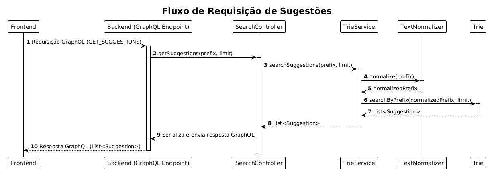

## Desafio de Autocomplete

Este documento detalha as decisões de arquitetura, as escolhas técnicas, a implementação e as decisões tomadas durante o desenvolvimento da aplicação.

---

### Arquitetura geral

O desafio foi abordado com uma arquitetura modular, dividida em duas camadas princpais (como sugerido na descrição):
um Frontend desenvolvido em ReactJS e um Backend construído com Spring Boot em Java.
A comunicação entre essas camadas é feita via GraphQL.
Todo o ambiente de desenvolvimento e produção é conteinerizado utilizando Docker Compose.

Internamente, o sistema segue uma estrutura em camadas lógicas, cada uma com uma responsabilidade específica. Essa abordagem foi escolhida visando a manutenção e escalabilidade do sistema, permitindo que cada parte evolua de forma independente.

---

### Visão geral da estrutura do projeto

Esta seção descreve brevemente a finalidade de cada arquivo e classe na estrutura do projeto.

```
projeto-autocomplete/
├── frontend/
│   ├── public/
│   │   └── jus_logo.png
│   ├── src/
│   │   ├── assets/
│   │   ├── components/
│   │   │   ├── SearchAutocomplete.tsx
│   │   │   ├── SearchInput.tsx
│   │   │   ├── SuggestionsList.tsx
│   │   │   ├── TermDefinition.tsx
│   │   │   ├── SearchMessages.tsx
│   │   │   └── SearchInstructions.tsx
│   │   ├── graphql/
│   │   │   ├── client.ts
│   │   │   └── queries.ts
│   │   ├── hooks/
│   │   │   └── useSearchAutocomplete.ts
│   │   ├── types/
│   │   │   └── Suggestion.ts
│   │   ├── utils/
│   │   │   └── searchUtils.tsx
│   │   └── main.tsx
│   ├── index.html
│   ├── package.json
│   ├── tsconfig.json
│   ├── vite.config.ts
│   ├── Dockerfile
│   └── .dockerignore
│
├── backend/
│   ├── src/
│   │   ├── main/
│   │   │   ├── java/
│   │   │   │   └── com/example/autocomplete/
│   │   │   │       ├── AutocompleteApplication.java
│   │   │   │       ├── config/
│   │   │   │       │   └── CorsConfig.java
│   │   │   │       ├── controller/
│   │   │   │       │   └── SearchController.java
│   │   │   │       ├── model/
│   │   │   │       │   └── Suggestion.java
│   │   │   │       ├── service/
│   │   │   │       │   ├── DataLoadService.java
│   │   │   │       │   └── TrieService.java
│   │   │   │       └── util/
│   │   │   │           ├── TextNormalizer.java
│   │   │   │           ├── Trie.java
│   │   │   │           └── TrieNode.java
│   │   │   └── resources/
│   │   │       ├── application.properties
│   │   │       ├── graphql/
│   │   │       │   └── schema.graphqls
│   │   │       └── data/
│   │   │           └── glossary.json
│   │
│   │   └── test/
│   │       └── java/
│   │           └── com/example/autocomplete/
│   │               ├── controller/
│   │               │   └── SearchControllerTest.java
│   │               ├── integration/
│   │               │   ├── AutocompleteIntegrationTest.java
│   │               │   └── TrieServiceIntegrationTest.java
│   │               ├── model/
│   │               │   ├── SuggestionTest.java
│   │               │   ├── TrieNodeTest.java
│   │               │   └── TrieTest.java
│   │               ├── service/
│   │               │   ├── DataLoadServiceTest.java
│   │               │   └── TrieServiceTest.java
│   │               └── util/
│   │                   └── TextNormalizerTest.java
│   ├── pom.xml
│   ├── Dockerfile
│   └── .dockerignore
│
├── docker-compose.yml
├── README.md
└── COMMENTS.md
```

---

### Frontend

O frontend foi desenvolvido utilizando ReactJS e TypeScript. Para a comunicação com a API, foi empregado o Apollo Client. A estilização foi realizada com Tailwind CSS, o que permitiu criar um desing responsivo.

#### Organização e Componentização:

A estrutura do projeto no frontend foi feita visando maximizar a reutilização de componentes, além de permitir uma organização clara dos diretórios. A seguir temos a descrição de alguns dos arquivos que o compõem:

- **SearchAutocomplete.tsx**: Componente principal responsável pela lógica e renderização dos demais elementos da interface.

- **SearchInput.tsx**: Componete responsável pela entrada de textodo usuário.

- **SuggestionsList.tsx**: Exibe a lista de sugestões retornadas pelo backend, gerenciando a quantidade de sugestões visíveis (máximo 20).

- **TermDefinition.tsx**: Um componente que apresenta a definição de um termo selecionado pelo usuário.

- **SearchMessages.tsx**: Exibe mensagens ao usuário.

- **SearchInstructions.tsx**: Fornece instruções para intergir com a aplicação.

- **useSearchAutocomplete.ts**: Um hook que encapsula toda a lógica de estado e interação do usuário com a aplicação.

- **client.js**: Configuração do cliente Apollo para se conectar ao GraphQL.

- **queries.js**: Definição das queries GraphQL utilizadass.

#### Normalização do texto:

Uma decisão importante para a experiência do usuário foi a implementação de um componente para normalizar o texto digitado pelo usuário (localizado em searchUtils.tsx). Por "normalizar", entende-se remover acentos, converter todos os caracteres para minúsculas e eliminar espaços que não comprometam a busca, permitindo que termos como "ação", "Acao" ou "AÇÃO" sejam tratados da mesma forma. Isso garante que o sistema ofereça sugestões mais consistentes, independentemente de como o usuário digita o termo.

---

### Backend

O backend foi desenvolvido em Java utilizando o framework Spring Boot. A escolha dessas tecnologias foi devido a maior familiaridade com o ecossistema Java, além da facilidade de integração com bibliotecas prontas para lidar com requisições GraphQL e realização de testes unitários e de integração (JUnit e Mockito).

#### Arquitetura em camadas:

A arquitetura do backend segue o padrão de camadas, com classes bem definidas para cada responsabilidade: config, controller, modal, service e util. Essa abordagem promove a separação de responsabilidades entre as classes, tornando o código mais organizado e fácil de manter.

Abaixo estão as principais camadas da arquitetura do backend e seus respectivos diretórios:

| Camada               | Descrição                                                                                                                                                                                                                 | Pacote                        |
| :------------------- | :------------------------------------------------------------------------------------------------------------------------------------------------------------------------------------------------------------------------ | :---------------------------- |
| **Model Layer**      | Contém as classes de modelo da aplicação, como `Suggestion`, que representa os termos e definições a serem sugeridos. Também possui a implementação da estrutura Trie (Trie, TrieNode) utilizada para buscas por prefixo. | `com.autocomplete.model`      |
| **Service Layer**    | Lógica de negócio, como carregamento de dados (`DataLoadService`) e operações sobre a Trie (`TrieService`).                                                                                                               | `com.autocomplete.service`    |
| **Controller Layer** | Exposição do endpoint GraphQL via `SearchController`, que orquestra as chamadas para os serviços.                                                                                                                         | `com.autocomplete.controller` |
| **Util Layer**       | Contém utilitários como `TextNormalizer`, responsável por normalizar texto para buscas.                                                                                                                                   | `com.autocomplete.util`       |
| **GraphQL Layer**    | Define o schema e as queries GraphQL expostas pela aplicação.                                                                                                                                                             | `src/main/resources/graphql/` |
| **Config Layer**     | Gerencia configurações da aplicação, incluindo a configuração do CORS.                                                                                                                                                    | `com.autocomplete.config`     |

A seguir estão alguns dos componentes do backend.

- **AutocompleteApplication.jav**: Classe principal que inicializa a aplicação.

- **DataLoadService.java**: Serviço responsável por carregar os dados das sugestões a partir de um arquivo JSON (glossary.json).

- **Suggestion.java**: Model que representa uma sugestão, contendo os campos term (o termo da sugestão) e definition (sua definição).

- **TextNormalizer.java:** Classe utilitária que implementa a lógica de normalização de strings, removendo acentos e convertendo caracteres para minúsculas. Essa normalização é fundamental para garantir que a busca na Trie seja insensível a variações de formatação.

- **TrieNode.java**: Representa um nó individual na Trie. Cada nó armazena um caractere, um mapa para seus filhos (que também são TrieNodes), e flags para indicar se é o fim de uma palavra, a palavra completa e sua definição.

- **Trie.java:** Contém a implementação da estrutura da Trie. Contém o método "insert", para inserir novos termos e suas definições, e o método "searchByPrefix", no qual realiza a busca por todas as sugetões que começam com um determinado prefixo. A busca é realizada utilizando estratégia da Busca em Largura (BFS).

- **TrieService.java**: Serviço que gerencia a instância da Trie. Ele utiliza a anotação @PostConstruct para carregar e popular a Trie com os dados do glossary.json assim que a aplicação é iniciada.

- **SearchController.java**: O controlador GraphQL que expõe o endpoint /graphql para o frontend. Ele define a query getSuggestions, que aceita um prefix e um limit como argumentos e delega a lógica de busca ao TrieService.

#### Fluxo de uma requisição:

1 - Ao iniciar, o Spring Boot executa o @PostConstruct no TrieService, que por sua vez utiliza o DataLoadService para carregar o glossary.json e popular a Trie em memória.

2 - O frontend envia uma requisição GraphQL (GET_SUGGESTIONS) para o endpoint do backend, passando o prefixo digitado e o limite de sugestões desejado.

3 - O SearchController recebe essa requisição e a encaminha para o TrieService.

4 - O TrieService normaliza o prefixo recebido (utilizando TextNormalizer.tsx) e invoca o método searchByPrefix na Trie.

5 - A Trie executa a busca e retorna uma lista de objetos Suggestion que correspondem ao prefixo, respeitando a quantidade limite de sugestões a serem retornadas.

6 - O SearchController envia essa lista ao frontend como resposta GraphQL.

O diagrama de sequências abaixo descreve esse fluxo:



---

#### Testes

Foram construídos aproximadaente 40 testes unitários para o backend, cobrindo as principais funcionalidades e casos de borda da aplicação. Os testes foram projetados para garantir o cumprimento dos requisitos do sistema.

Exemplos de cenários testados:

Verificação de que o retorno de sugestões respeita o limite máximo de 20 itens.

Confirmação de que a busca só retorna sugestões para prefixos com no mínimo 4 caracteres.

Validação de que um prefixo vazio não retorna nenhuma sugestão.

Testes da funcionalidade de normalização de texto.

Testes de inserção e busca na Trie.

Também foram realizados testes de integração, testando toda a API ponta a ponta.

---

### Estrutura de Armazenamento (Trie)

A escolha da Trie como estrutura de dados para o armazenamento das sugestões foi pensada devido às suas características intrínsecas, que se adequam perfetamente com os requisitos de um sistema de busca por prefixo. Para mais, a Trie é otimizada para operações de inserção de termos e busca por prefixo. Entretanto, sabemos que em aplicações reais ou com quantidade da dados maiores, o uso de um banco de dados faz-se necessário.

A escolha pela Trie também foi motivada por sua facilidade de implementação, uma vez que evitou a necessidade de um contêiner Docker adicional, que seria necessário caso usássemos um sistema de banco de dados, simplificando a arquitetura do projeto.

O populamento automático da Trie é realizado pela classe DataLoadService.java, que carrega os dados diretamente a partir de um arquivo glossary.json.

---

### Obtenção dos Dados

Para a obtenção dos dados das sugestões, foi realizado um web scraping em Python no site do STF (Supremo Tribunal Federal), especificamente na seção de glossário jurídico (https://portal.stf.jus.br/jurisprudencia/glossario.asp). Este processo resultou na coleta de aproximadamente 180 termos e suas respectivas definições, que foram salvas em um arquivo glossary.json.

O âmbito jurídco foi o escolhido como domínio para os termos.

Como as definições dos termos estavam facilmente acessíveis com o scraping, optamos por enriquecer a experiência do usuário incluindo, além do termo em si, a definição completa de cada termo. Dessa forma, ao selecionar uma sugestão, o usuário pode visualizar sua definição detalhada clicando no ícone de lupa.

Adicionalmente, para validar o requisito de limite de sugestões (máximo de 20), foram incluídas aproximadamente 50 sugestões simuladas, geradas com o auxílio de LLMs. Essas sugestões adicionais foram criadas intencionalmente para os termos "ação" e "direito", visando simular cenários onde a busca por prefixos resultasse em um volume superior a 20 itens. Todos as sugestões simuladas foram adicionadas com um '\*' ao final, e com uma descrição padrão.

Atualmente, a Trie contém cerca de 250 sugestões, combinando os termos reais obtidos via web scraping e os termos simulados.

---

### Implementações Futuras

Se houvesse tempo adicional, as seguintes melhorias seriam consideradas:

1. Adição de estatísticas: Implementar métricas como a frequência com que determinados termos são pesquisados, bem como estatísticas internas da Trie — como a quantidade total de nós e número de palavras armazenadas.

Para isso, adicionaria um atributo "frequency" ao Suggestion model que seria incrementado a cada pesquisa do termo. As estatísticas internas da Trie poderiam ser expostas através de uma query GraphQL específica, retornando informações que são fáceis de obter com os métdos nativos de um objeto Java (como trie.size()).

2. Testes no frontend: Expandir a cobertura de testes para incluir testes automatizados no frontend.

3. Interface de administração: Desenvolver um painel que permita cadastrar, editar e remover termos diretamente pela interface. Para isso, nova queries do tipo "mutation" deveriam ser adicionadas ao schema do Graphql, bem como endpoints específicos para tais requisições, tais como: setTerm(), editTerm() e deleteTerm().

---

### Como compilar e executar o projeto

1. Clone deste repositório (ou fazer o download .zip):

```
 git clone https://github.com/gustavojorge/projeto-autocomplete.git
```

2. Rodar o Docker compose

```
docker compose up --build
```

**Observações**:

- Certifique-se de que o Docker esteja instalado e em execução em sua máquina antes de rodar o projeto.
- O backend será executado na porta 8080 → http://localhost:8080.
- O frontend será executado na porta 3000 → http://localhost:3000
- Verifique se nenhuma outra aplicação está utilizando as portas 8080, 3000 ou 5173, pois isso poderá impedir a execução correta do projeto.

---
